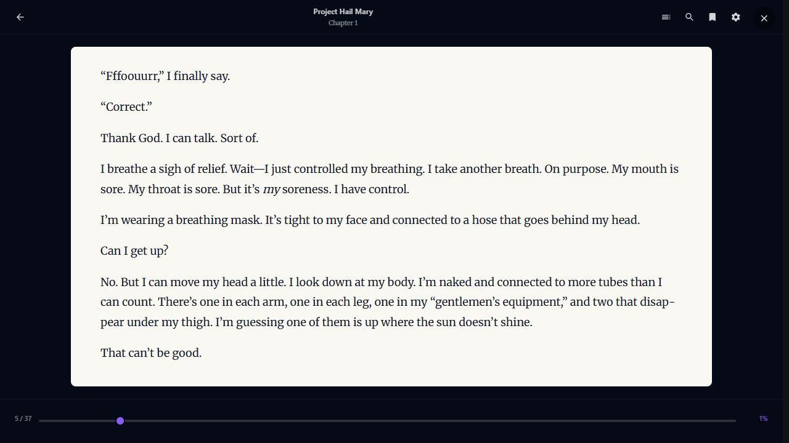

# Real-media remediation implementation and verification

## Product-owner walkthrough

1. **Audiobooks are books again.** The 402 audiobook files now belong to eight recordings. Fahrenheit 451 has one library entry with its 42 original parts. Existing file locations and asset IDs are retained. This implements W2/W10; the library's eight-item browse was observed in the running Dashboard.
2. **Descriptions and dates are cleaner.** The repair normalized 130 stored descriptions, preserving raw provider evidence. A repeat dry run found zero descriptions still needing cleanup. Radioactivity retains the verified retail release identity and 2013 year; the conflicting 1975 reconciliation was withdrawn. This implements W1/W6.
3. **Available files can appear before provider work finishes.** Normal, accessible assets no longer disappear simply because identity is pending or requires review. Cards and song rows can show Updating details; edit controls and covered metadata API routes reject changes during active ingestion/identity work. Personal playback remains separate. This implements W3.
4. **Players navigate and start correctly.** Songs and the music player link to resolved people and albums. Music has no generic track detail button. Browser playback uses the authenticated Dashboard proxy. Movie conversion publishes playable segments before full-film conversion completes, with a local HLS client and text-caption support. Inactive audio events cannot pause a video. This implements W4/W5/W7.
5. **Reading and episode navigation are usable.** The EPUB reader uses a readable paper surface, restores a text offset, avoids repeated pagination on timer renders, saves on page changes, and weights progress by content length. TV episodes have both horizontal navigation controls. This implements W8/W9.

The supplied screenshots guide presentation; actual files supply titles, text, tracks, duration, and playback. This work does not invent missing metadata or rename chapters to match a mockup.

## Catalogue repair and source protection

- Backup before repair: `tools/reports/real-media-20260926/remediation/library-before.db` plus configuration snapshots.
- Applied repair: eight recordings / 402 assets / 130 descriptions. Old chapter Work records remain as redirect/history records; assets and their progress IDs are not replaced.
- Repeat dry run: eight recordings / 402 assets / zero descriptions needing normalization.
- SQLite foreign-key check after repair: no violations.
- Radioactivity canonical year after repair: 2013; no retained canonical album QID/year from the rejected reconciliation.
- No repeat wipe. The initial real-media-only harness remains configured against `C:\Temp\real_import`.
- Source verification deliberately retains the **earlier folder-probe incident**: transient probe files changed three directory timestamps in the initial harness run. The report must never describe that entire run as mutation-free. Subsequent protected startup verification reports `monitoring_passed: true`, no new differences/events, and retains `historical_source_violation: true`.
- Repair and playback output go to managed database/cache/report locations. Originals are opened for reading; file names, tags, and folder organization are not rewritten.

## Implementation map

| Package | Main implementation |
| --- | --- |
| W1 | AngleSharp-based `DescriptionText`, canonical write normalization, description presentation normalization, existing-data repair. |
| W2 | Configured-source folder/disc hints; source-scoped recording identity; all parts share a Work; recording-level identity scheduling; preserved original track titles; lineage routes recording metadata to the recording; chapter identities retain the source asset and completion advances to the next original file. |
| W3 | Early MediaAdded publication; normal-asset visibility; durable lifecycle predicate; card/song status; edit disabling and server-side 409 responses on covered mutation routes. |
| W4/W5 | Immediate song gesture handling, current and legacy stream URL proxy mapping, album/person queue identities, player and row links, inactive-host event isolation, valid Restart query strings. |
| W6 | Album reconciliation requires matching source identifiers or artist corroboration; evidence-scoped repair removes the wrong reconciliation without a runtime title exception. |
| W7 | First-segment HLS publication, software fallback, atomic playlists, local pinned HLS.js, full duration in manifest, preparation retry, parallel caption extraction with authenticated discovery, paused-state caption notifications, bounded HLS request concurrency, and bottom transport controls with preparation/error feedback. |
| W8 | Font-ready pagination once per content change; exact character anchors retained across reflow; chapter word counts; page and slider saves; cleared transient selections; readable typography; statistics in Settings; separate Settings/Close hit targets and reader drawer layering. |
| W9 | Season episode scrolling through both arrows and removal of the CSS rule that hid them. |
| W10 | Offline repair with Engine/Dashboard leases, backup, transaction, foreign-key validation, retained redirects/history, and dry-run report. |

## Automated verification

Latest solution build: **passed, zero warnings and zero errors**.

The focused suites below contain **282 passing tests** in total.

| Suite | Result |
| --- | --- |
| API display, detail composition, adaptive HLS, and catalogue authorization, including Restart route shapes, first segment while video/captions are incomplete, shared preparation, and caption manifest delivery | 190 passed |
| Storage grouping, descriptions, visibility, and recording lifecycle lock | 28 passed |
| Playback session/controller primitives, current resource stream proxy routes, and multi-file audiobook transitions | 41 passed |
| Ingestion source-mutation protection and audiobook folder hints | 21 passed |
| Album identity corroboration | 2 passed |

The broader Web suite previously ran with 1,133 passing and two failures in unchanged files: the minimum typography guard flags `ViewPlacesTimeline.razor.css`; the HTTP-envelope inventory reports 24 raw GET calls against its ceiling of 23. These are not reported as passing or silently changed in this remediation.

## Browser observations

- Audiobook browse: eight items, including one Fahrenheit 451 entry.
- Music: a single Play Drifting action produced `paused=false`, `readyState=4`, and advancing time. Clicking its album link opened Live Love Life while playback continued beyond 17 seconds.
- Reader: the real Project Hail Mary EPUB rendered legible dark text on a cream page; chapter 1 displayed 0% rather than the old chapter-count-derived 15%.
- Video: American History X (VC-1/DTS-HD source) decoded at 854×480 through HLS. After parallel caption preparation, one Restart action produced advancing video: at 5.6 seconds after the click, playback time was 2.6 seconds with `paused=false` and `readyState=4`, implying approximately three seconds to start versus the earlier approximately 56 seconds. English and German caption tracks arrived later.
- After the HLS request-policy correction, over 122 resource requests succeeded without a 429 response. Seeking forward reached 4:33 with `paused=false`, `readyState=4`, and a growing seekable range beyond 7:24. English subtitle text rendered during dialogue. That visual check prompted caption placement above the controls; source-authored non-automatic cue positions are retained.
- Final caption placement was observed at 4:37–4:40: readable text above the transport, with one bottom play/pause control and no central button covering the movie. [Playback screenshot](assets/real-media-remediation-2026-09-26/video-captions-verified.png).
- TV: both Previous episodes and Next episodes are present. Observed horizontal scroll positions were 10 → 846 → 10 after right and left actions.
- Reader reload initially exposed a collapsed-whitespace anchor bug; the locator now skips zero-area characters. Advancing from page 4 to page 5 in chapter 1 and reloading restored page 5 and the exact same passage. The remaining statistics overlap was removed by moving those values to Settings.
- Settings was initially obscured by the persistent Close hit target. The header reserves that space, and reader drawers now sit above the reader's chrome rather than behind it.
- Final reader interaction: Settings opened correctly; changing font size from 18 to 20 kept the saved passage visible (chapter pagination changed from 37 to 44 pages). Returning to 18 restored the exact original passage and page 5/37, without backward drift. The original size was restored after testing.
- Movie Restart exposed a malformed `&restart=true` route when no query string existed. The corrected route uses `?restart=true`, covered by behavioral tests for both route shapes.

Verified reader after reopening at the same passage; reading statistics no longer overlap the text:

## Limits that remain explicit

- A newly converting HLS movie can seek only within material already encoded; arbitrary late-film seeking requires its corresponding segments. This is progressive preparation, not a completed on-demand seek transcoder.
- Caption extraction now runs alongside video/audio preparation. Captions become available after extraction rather than delaying the first picture. A sustained test exposed the ordinary streaming quota rejecting HLS segments with HTTP 429; HLS now has a separate per-client-IP concurrency limit of eight active requests and a bounded queue of 64. Signed grants and per-resource authorization remain required. Caption-language selection beyond the existing toggle remains a separate UI enhancement.
- Bitmap subtitle formats are not converted through OCR. Failed text conversion is omitted rather than advertised as working captions. Disc images are not turned into invented playable titles.
- Folder grouping applies to configured audiobook sources. Mixed recordings in one folder, conflicting disc tags, and late-arriving parts need broader fixture coverage before claiming the full planned ingest matrix passed.
- The lifecycle checks cover ingestion/identity and the listed catalogue mutation filters. A transactional stale-editor race test and exhaustive structural/deletion endpoint audit remain outside the verified set.
- The full codec/device/mobile/200%-zoom and rapid-switch acceptance matrix is not established by unit tests alone. Only the browser observations listed here count as end-to-end evidence.

## Plain-English completion summary

The real library now presents audiobook recordings coherently, cleans provider descriptions, and sends music to the right artist and album pages. Playback and reading fixes use the existing files in place. The report separates observed improvements from the larger acceptance matrix and retains the earlier source-folder timestamp incident.
