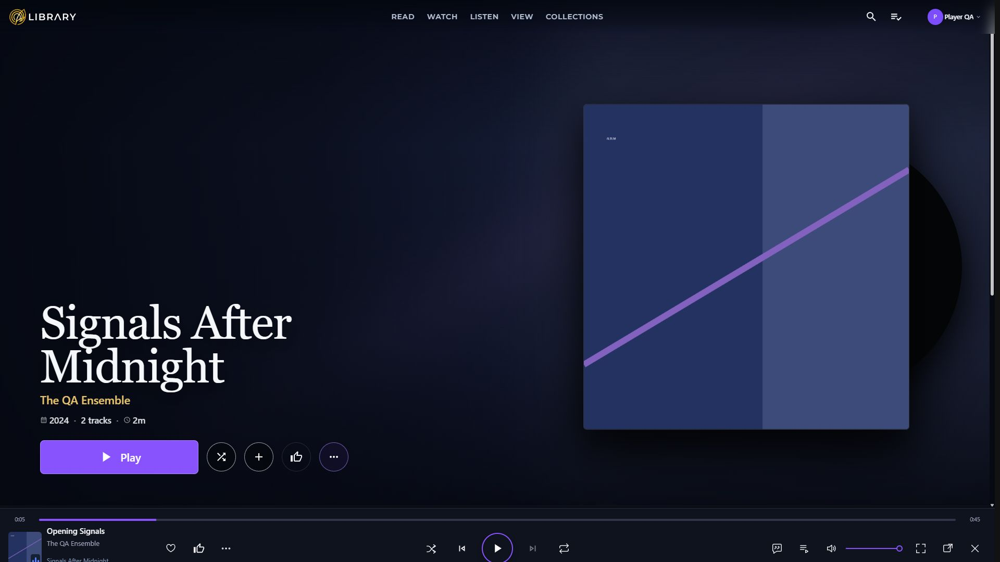
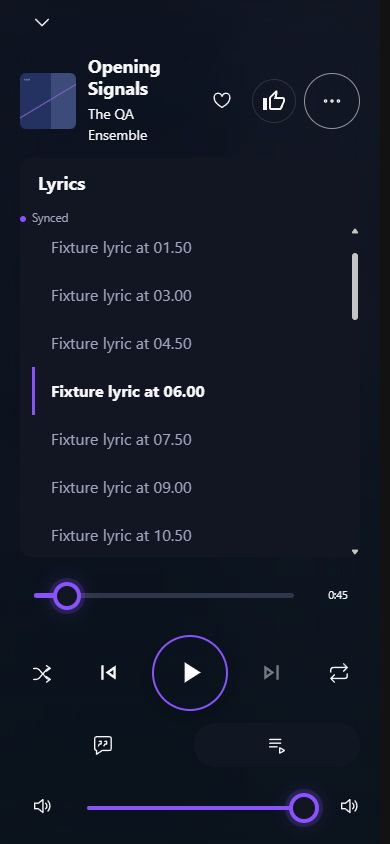

# CSS and interop cleanup evidence

October 5, 2026. Implemented locally on `codex/css-cleanup`, following the separately approved [player and controls delivery](player-controls-2026-10-05.md). The conservative cleanup is complete. The larger numeric ambitions in [F1–F3](../plans/player-and-controls-reviewed-plan-2026-10-05.md#follow-up-delivery-for-interop-and-css) remain open.

## Product walkthrough

1. **Keep the current experience with less styling code.** Album, movie, book, owned-episode, Home, Listen, and editor screens retain their current layouts. The cleanup removes old layouts and repeated declarations rather than introducing a new visual design. This maps to F2 and F3. Acceptance is matching artwork geometry, text, controls, and scrolling in the desktop and phone comparisons.
2. **Avoid repeated setup while controls update.** Dropdowns retain one observer when their selected label changes. Playback identity links retain their listener while refreshing the snapshot used for navigation. This maps to F1. Acceptance is one attachment after an unrelated rerender, registration when the element or relevant binding changes, and cleanup when disposed.
3. **Keep the player delivery intact.** Lyrics and Queue triggers remain icons with tooltips and accessible names. Playback, browsing, editing permissions, and media ownership keep their existing meanings. This maps to F1–F3. Acceptance is preserved transport and panel presentation; the cleanup does not add new library actions or change stored media.

Representative journeys: browse an album, open the editor's Details/Artwork/Match & Identity sections, inspect a long book title and an owned TV episode, and open the desktop lyric panel and phone player. All browser work used the existing disposable Player QA fixture. No configured-library playback or edits were performed. Fixture lyric seeks and volume changes were used to align presentation states after restarting the test hosts.

## Measurements

Baseline: clean `b73ea58c`, immediately after the player/control delivery. Both bundle measurements use the same .NET SDK 10.0.204, `Release/net10.0`, and uncompressed byte units. The SDK is selected through the repository's roll-forward configuration.

| Measure | Before | After | Reduction |
| --- | ---: | ---: | ---: |
| Isolated CSS bundle | 1,825,806 bytes | 1,526,997 bytes | 298,809 bytes / 16.37% |
| First-party CSS source | 1,856,184 bytes | 1,546,774 bytes | 309,410 bytes / 16.67% |
| Source declarations | 39,514 | 33,203 | 6,311 |
| Source `!important` declarations | 2,137 | 1,894 | 243 / 11.37% |
| Source lines | 58,683 | 47,846 | 10,837 |

Source totals cover 232 CSS files under `src/MediaEngine.Web`, excluding `bin`, `obj`, and `vendor`. The isolated bundle is `obj/Release/net10.0/scopedcss/bundle/MediaEngine.Web.styles.css`; global `wwwroot/app.css` is counted only in source totals. Vendor CSS and generated bundle files were not edited. Priority counts also match raw source-marker counts. No new priority overrides were added.

The [measurement inventory](css-cleanup-measurements-2026-10-05.json) records each changed file and the current 43 render overrides. The largest component files now contain 6,861 lines (`DetailPage`), 4,997 lines (`SharedMediaEditorShell`), and 2,020 lines (`ListenPage`).

## Removal proof and tooling

Thirty-two CSS files changed. The two removal passes deleted 757 exact duplicate declarations and 2,212 retired selector occurrences. Duplicate removal requires identical selector, property, value, priority, and conditional/layer context; all members of a grouped selector must be superseded. Different-value fallbacks and keyframes remain. Anonymous layers retain separate identities. The reusable tool conservatively preserves final declarations without semicolons because parser tokens expose source starts rather than trustworthy source ends.

Retirement is supported by an explicit manifest of positive classes absent from application source, checked against static tokens and dynamic prefixes across `src`. The retired families include earlier editor layouts, old detail controls, and superseded shared-control styles. Classes inside selector functions are not treated as absence proof. Screenshots support visual review; they do not establish that a rule is dead. The final audit reports no unreferenced classes in the reviewed families and no remaining removable exact duplicates.

Four files were preserved because the parser cannot safely handle their current syntax: `LibraryConfigurableTable`, `StageGate`, `TuvimaArtworkStack`, and `BookDetailContent`. Their reasons are in the inventory. This pass does not activate or reinterpret their unsupported rules.

The development-only parser dependency is pinned in `scripts/css/requirements.txt`; there is no new application dependency or build-time CSS bundler. Reproduction and pruning safeguards are documented in `scripts/css/README.md`.

## Browser lifecycle evidence

- **AppSelect:** an unrelated rerender leaves the total at one playback attachment. Changing the accessible label produces the second attachment; switching to ordinary appearance produces one detach. Its existing portal observer remains responsible for replaced internal triggers.
- **Intrinsic sizing:** changing the full label retains one `ResizeObserver`, recalculates truncation, and updates tooltip content. Disposal disconnects it; a new mount creates a new observer.
- **PlaybackIdentityLink:** a refreshed playback version retains one listener but activation receives the new rendered snapshot. Replacing the anchor produces a second attachment; disposal detaches it.

Other render overrides remain inventoried rather than indiscriminately removed. First-render initialization, native timing, source changes, focus reconciliation, gallery/timeline observation, and portal state updates still have legitimate responsibilities. The tests measure the changed paths; this report does not claim a runtime call profile of every remaining component.

## Validation

| Check | Result |
| --- | --- |
| Solution restore | Passed |
| Debug and Release solution builds | Passed, zero warnings/errors |
| Full .NET solution suite | 5,036 passed, 34 existing external-provider skips, zero failures |
| Dashboard tests within that suite | 1,702 passed |
| JavaScript suite | 118 passed |
| CSS parser/cascade safety checks | 6 passed |
| Patch whitespace check | Passed |
| Strict documentation build | Passed |

Existing tests that required retired selector names now check the current shared owners. Their other behavioral and layout assertions remain. New checks cover observer reuse, fresh navigation authority, element replacement, dropdown binding inputs, and parser safety.

Before/after captures cover 23 states at 1920×1080 and 390×844: Home, album/movie/book/TV details, Listen, music browse, three editor sections, desktop lyrics, and phone artwork/lyrics. Computed-style samples compare geometry, typography, colors, and surface properties. Stable detail, Listen, and lyric states match; editor differences are transient ripples/transitions, and the player seek-fill width reflects the aligned fixture time. A hover tint and temporary font-loading widths are identifiable capture differences. Home's hero properties match; fixture music progress added one Continue item after the seek, so its shelf contents and allocation are not an identical-data comparison. The long-title Home clipping already exists in the baseline and is outside this maintenance change.

The paired captures live beside these images using `before-` and `after-` filenames. These checks do not certify every permission/error state, physical-device output behavior, or native popout behavior. Those wider acceptance limits remain visible in the player report and reviewed plan.

## Remaining targets and concrete next scope

The 900,000-byte bundle target, 60-percent priority reduction, and 2,000-line component target are not achieved. Reaching them needs active-style ownership work, rather than further deletion based on screenshot absence or cosmetic file splitting.

The next reviewable scope is to move live hero/metadata/navigation/sequence/credit rules from `DetailPage` into their actual component owners, then extract the editor's metadata, artwork, identity comparison, and history styling into corresponding owned sections. Review Blazor scope attributes, descendant and portal selectors, media queries, and the existing MudBlazor overrides before reducing priorities. Finish with the small remaining Listen ownership boundary. Require the broader state matrix and same-configuration measurements for each extraction. This scope preserves product behavior and excludes a new player or browse design. It needs a concrete follow-up scope decision before widening this completed conservative pass.

## Plain English completion summary

The Dashboard now carries less styling code and avoids unnecessary setup when selected controls update. The checked screens keep their current appearance, including the icon-only player buttons. The larger size goals remain visible as component refactoring work; they are not reported as achieved.
