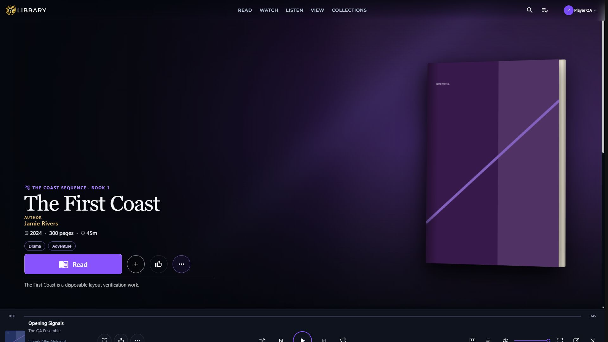
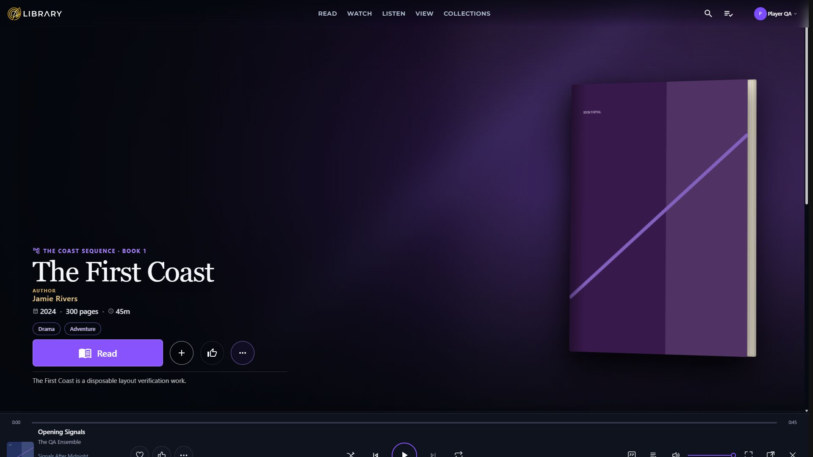
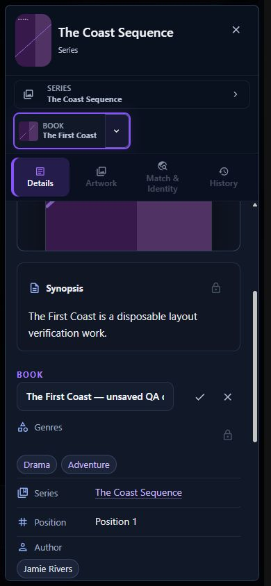
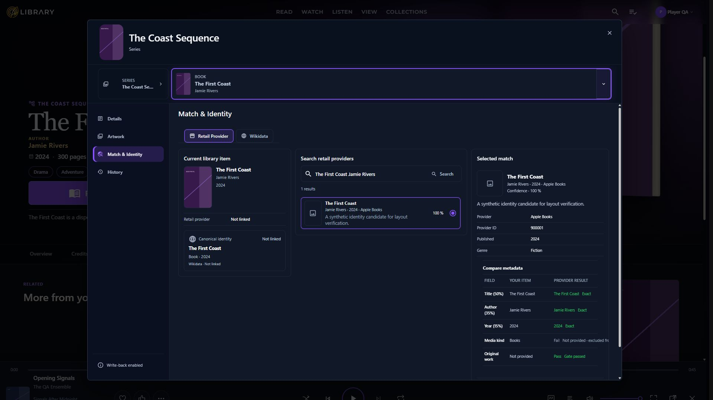
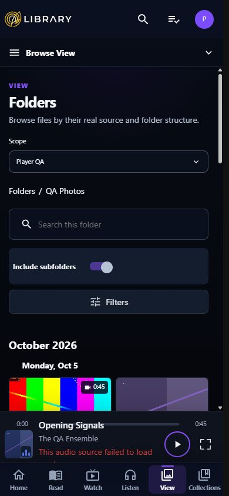

# Dashboard CSS ownership implementation — 6 October 2026

The ownership implementation is reviewable, but final acceptance is pending. The 2,000-line limit and priority-reduction gate pass. The isolated bundle is larger, so the reviewed plan's strict bundle-reduction gate fails. No acceptance amendment has been approved.

## Product-owner walkthrough

1. **Browse and open the same media.** Home and detail pages retain their artwork, titles, progress, navigation, and actions. Hero, credits, tracks, and sequence content now keep their presentation beside their markup. A detail-only change remains restricted to detail pages. This implements walkthrough change 1 and WP2–WP3 of the [reviewed plan](../plans/css-ownership-reviewed-plan-2026-10-05.md).
2. **Use the same editor.** Details, Artwork, Match & Identity, History, and the header are internal components within the existing single editor. The shell still owns drafts, permissions, target selection, API calls, save/apply/cancel, and the unsaved-change warning. No additional editor, route, or persistence mechanism was introduced. This implements change 2 and WP4.
3. **Keep Settings, switches, and Listen familiar.** Settings owns its page styling; the shared switch owns its row. Generic controls and portal styling retain their shared placement. Listen keeps inline playlist navigation and its dormant audiobook/artist presentation. Player styles and playback ownership remain protected. This implements changes 3–4 and WP5–WP6.
4. **Make maintenance easier to check.** The audit, stylesheet limits, transfer-aware override budgets, and declared comparison matrix prevent future changes from silently undoing the ownership work. The report separates source size, generated size, and visual evidence. This implements change 5 and WP1/WP7.

The intended observable acceptance is the same visible experience and behavior across representative desktop and phone journeys, plus enforceable maintenance limits. Broader interop cleanup, redesign, playback changes, real-device validation, and substantial stylesheet optimization remain outside this delivery.

## Measurements

The fresh baseline and final build use SDK **10.0.401**, Release, and the same bundle path: `src/MediaEngine.Web/obj/Release/net10.0/scopedcss/bundle/MediaEngine.Web.styles.css`. The repository SDK resolver selected this installed SDK from `global.json`. The earlier historical bundle number is not used as the fresh baseline.

| Measure | Fresh baseline | Implementation | Result |
|---|---:|---:|---|
| First-party CSS files | 233 | 256 | 23 new markup owners |
| Raw source bytes | 1,572,137 | 1,581,075 | +8,938 |
| UTF-8/LF source bytes | 1,539,131 | 1,569,290 | +30,159 |
| Source lines | 47,846 | 48,718 | +872 |
| Parsed declarations | 33,190 | 33,186 | −4 |
| Non-comment `!important` markers | 1,894 | 1,892 | −2; hard direction gate passes |
| Non-comment `::deep` markers | 3,639 | 2,993 | −646 (17.75%) |
| Release isolated bundle bytes | 1,526,854 | 1,586,713 | +59,859 (3.92%); hard gate fails |
| Global `app.css` bytes | 155,626 | 131,435 | −24,191 |
| Bundle plus `app.css` bytes | 1,682,480 | 1,718,148 | +35,668 (2.12%) |
| Largest isolated stylesheet | 6,861 lines | 1,993 lines | Hard line gate passes |

The 900,000-byte bundle and 60% priority-reduction stretch goals are unmet. Settings has 372 priorities versus 191 initially because 181 existing global priorities moved into its owner; the 50% Settings reduction stretch goal is unmet. A relocation is not counted as a removed priority.

Moving Settings globals into isolation adds those rules to the bundle, and Blazor scope/context selectors add overhead. The bundle-plus-global total also grows, so this is not explained entirely by moving bytes between files. No bundler or application dependency was added.

Raw and LF-normalized bytes are separate to expose checkout line endings. Counts exclude generated `bin`/`obj` and vendor files. Source markers and line limits include parser-unsupported files; parsed-declaration totals cannot fully describe those files. The four unsupported stylesheets remain unchanged. The [measurements](assets/css-ownership-2026-10-06/measurements.json) include every file's lines and marker counts.

## Ownership and retained boundaries

| Owner | Final lines | Responsibilities |
|---|---:|---|
| DetailPage | 1,052 | Page/stage/tab layout, contextual shared boundaries |
| CinematicHeroSurface / HeroBackdrop / DetailHeroContent | 313 / 978 / 1,047 | Shared hero geometry and native presentation |
| SequencePlacementPanel / SequenceEntryContent | 1,685 / 634 | Parent structure and preferences / existing entry markup without a new wrapper |
| AudioItemTable / OverviewTab / DetailPrimaryModule | 1,041 / 523 / 947 | Tracks / overview composition / native primary presentation |
| SharedMediaEditorShell | 1,938 | Editor chrome, state, operations, shared boundaries |
| Header / Details / Match / Artwork / History sections | 446 / 629 / 930 / 972 / 423 | Explicit values and typed callbacks; no data-service ownership |
| Settings / AppSwitchRow | 1,535 / 36 | Settings canvas descendants / shared native switch row |
| ListenPage / ListenNavigationSection | 1,993 / 55 | Inline playlist and dormant presentation / native section links |

State-changing editor EventCallbacks retain the shell as receiver. Read-only formatting delegates and the artwork workspace reference are presentation integrations; save and API operations stay in the shell. Existing source assertions follow the new owners, and a parent-render callback test checks dirty, cancel, and asynchronous save boundaries.

Native moves remove unnecessary deep traversal. Zero-specificity context preserves detail-only rules and existing winning declarations. Render fragments, C# renderers, Mud/shared controls, and portals retain explicit boundaries where the stylesheet owner does not emit the final HTML element. Previously unmatched selectors are not broadened into newly active rules.

The ratchet fixture records balanced transfers for every owner whose priority/deep budget grows. Settings and the switch's new isolation boundaries consume released DetailPage deep capacity; their CSS originates in globals, which had no deep budget. Unknown owners receive zero override budget. The line-exception list is empty. `finalized` remains false because the bundle gate is outstanding.

Two desktop background mask declarations lost `!important`: their existing detail context now out-specifies the ordinary base mask within the actual markup owner. Their values and computed result remain unchanged. One ordinary `width: auto` declaration is reported as dominated after consolidation and retained; it does not affect the priority direction gate.

Legacy `tvdb-show-order*` and `tvdb-match-result*` groups are retained conservatively. A broad retirement check encounters a non-DOM `tvdb-` filename prefix, so it cannot authorize automatic deletion. They fit within the shell cap. Dormant Listen branches are also retained. Global portal popups, mixed shared/Settings selector groups, and generic vendor control tracks remain global for their other consumers. The ownership inventory's 2,091 unresolved static selector classifications are review candidates, including renderer/shared/vendor boundaries; they are not asserted to be unused styles.

## Verification and limitations

Solution restore and Release build pass with **zero warnings and zero errors**. The full solution passes **4,958 tests** with **34 existing explicit live-provider skips**, including **1,716 Dashboard tests**. The offline comparator passes **8 tests**, and the CSS audit passes **14 tests** with the 2,000-line check covering unsupported files. Strict MkDocs and `git diff --check` pass.

The [declared comparison](assets/css-ownership-2026-10-06/comparison.json) covers **117 original/final pairs**, with **zero unexplained computed-style differences and zero tolerances**. Paired book, editor, match, switch and Settings screenshots were visually reviewed. Responsive remounts, smooth scrolling, hover transitions, explicit pause and rename state were settled before recapturing; error/degraded fixture data was not substituted for healthy baselines. Final whitespace cleanup changes no declarations or selectors.

The fixture is disposable and uses fictional media, people, local artwork, and a loopback provider stub. Captures use ordinary UI actions and read-only DOM/style inspection. Missing selectors and incomplete state/viewport sets fail. Scope hashes are ownership evidence rather than visual differences. Full runtime evidence remains ignored; selected screenshots and aggregate measurements are retained in this report's assets.

Captures cover desktop 1920×1080, phone 390×844, selected 1920×900 views, editor/switch 320×568, and player 420×780. These are browser viewport checks at the observed DPR, not physical-device or high-DPR proof. There is no documented hover/touch/reduced-motion emulation API. Playlist capture includes the empty fixture and rename controls; successful populated playlist playback/reordering is not established. The paused fixture audio reports a source failure in both versions; visual player checks do not establish successful playback. Named missing-manifest display, provider apply/save against an external service, and ordinary-profile visual restrictions must not be inferred from screenshots of the administrator fixture. Existing behavior/permission tests remain the evidence for those protected paths.

## Acceptance decision

The concrete proposed amendment is to accept the ownership refactor at **1,586,713 isolated bundle bytes**, ratchet that value against future growth, and track substantial reduction as a separate optimization delivery. All other fidelity and ownership requirements remain applicable. Browser coverage limitations remain explicit; full-size artwork uses the existing new-tab action rather than an assumed legacy lightbox. This proposal is **unapproved**. The original gate requires a smaller bundle; this report does not redefine a failed check as passing.

## Selected visual evidence

The original is on the left and the implementation on the right. These images contain only fictional fixture data.

| Surface | Original | Implementation |
|---|---|---|
| Book detail |  |  |
| Phone editor draft |  |  |
| Selected match |  |  |
| View switch |  |  |

## Plain-English completion summary

The Dashboard's styling now has clearer owners, its large stylesheets meet the maintenance limit, and automated checks protect the extraction. The intended screens and editor workflows remain familiar. The recorded validation passes; final acceptance still needs a decision about the larger generated CSS download; broader interop and size optimization remain separate work.
