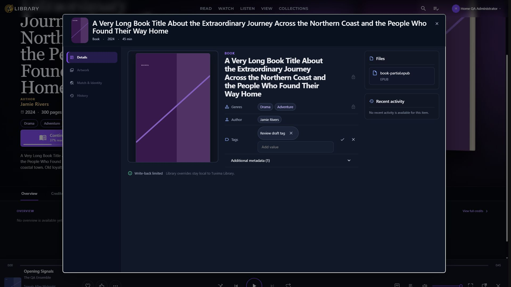

# Review fixes — October 6, 2026

Implemented on `codex/mud-removal-all-phases`, continuing `d6ab8ed1`.
The attached recommendations were reviewed as task material. The user's instruction
to proceed authorized the fixes; model routing and unrelated process termination
instructions in the attachment were not treated as independent authorization.
No merge or push was performed.

## Product walkthrough

1. **Settings opens normally while data loads.** Profile, Security and Playback
   show appropriately sized loading placeholders, followed by their existing
   controls. Books retain their text and circular loading shapes. Users follow
   the same Settings navigation; the existing unavailable Privacy destination
   still opens Profile. Acceptance: no render failure, truthful loading state,
   then visible page content. Maps to **F1 and F5**.
2. **An unfinished edit stays open when Escape belongs to the dialog.** Open a
   book's More actions > Edit details, edit Tags, then move focus outside the
   field and press Escape twice. Exactly one editor remains visible with the
   unsaved tag. Cancel or field Escape cancels that field and returns focus to
   its Edit button. Close still offers Keep Editing/Discard when appropriate.
   A clean editor closes on one Escape, restoring its opener and page scrolling.
   The first Escape in an artwork picker closes only that picker. Acceptance:
   these behaviors hold on desktop and a phone viewport. Maps to **F2 and F6**.
3. **Published builds carry their own CSS build instructions.** Deployments can
   restore the Dashboard using the files copied into the Docker build stage.
   CI checks the actual Release CSS, compression and fingerprints. Acceptance:
   restore succeeds and removing the import COPY or disabling minification makes
   verification fail. Maps to **F3 and F4**.
4. **Future component mistakes are caught automatically.** Misspelled or retired
   component options cannot hide inside captured HTML attributes. The Not Found
   message is centered. Acceptance: all source-derived Settings destinations and
   representative library pages render their expected loaded content. Maps to
   **F5 and F6**.

The browsing, reading, watching and listening journeys retain their existing
routes and presentation contracts. This work changes shared Dashboard controls,
tests, build packaging and documentation. It does not change authentication policy,
backend behavior, storage, playback ownership, contracts, vendor assets or token
values. The two Domain changes are documentation comments only.

## Technical fixes and evidence

### F1 — Skeletons and component contracts

`AppSkeleton` now supports CSS Width/Height, Rectangle/Text/Circle shapes and
captured HTML accessibility attributes. A labelled placeholder is a status; an
unlabelled one stays hidden from assistive technology. Explicit height overrides
the size minimum. Size-only callers retain their original classes and dimensions.
The obsolete Animation and SkeletonType attributes are removed/mapped.

MudBlazor 9's cached stylesheet confirmed text `scale(1, .6)` and 4px rounding,
circle 50% rounding and explicit rectangle zero rounding. The existing shimmer
remains. Browser Profile loading rectangles measured 180px and 220px.

Coverage includes `SkeletonSupportsSizedShapesAndAccessibleLoadingLabels`,
`UnlabelledSizeBasedSkeletonRetainsItsExistingGeometryContract`,
`UserOverviewLoadingRendersBothSizedSkeletonsBeforeTheRequestCompletes`,
`PlaybackLoadingRendersItsSizedSkeletonBeforeTheRequestCompletes` and
`AccountLoadingRendersThreeSizedSkeletonsBeforeTheRequestCompletes`.
The three tabs use delayed service responses so the tests actually observe loading.

The direct-parameter scan also exposed options that had silently fallen through
attribute capture: panel Elevation, thumbnail Rounded, uppercase HTML Role/Id,
tooltip Disabled, chip OnClose and hidden labels. Unsupported inert presentation
attributes were removed; valid HTML names and tooltip suppression were corrected.
Chip removal now invokes its existing callback and respects Disabled. Hidden
labels retain accessible names. Additional primitive tests cover these behaviors.

### F2 — Application-owned dialog closure

Native cancellation alone cannot protect a draft when repeated Escape produces a
non-cancelable close request. Managed dialogs now use `closedby="none"`, topmost
capture-phase key handling, a cancel fallback and an expected-open close recovery
path. Recovery retains the existing scroll lock, opener and prior inner focus.
The prior focus is saved before `showModal`, because reopening can move it.
Pending cancellation requests are coalesced and failures are reported.

An editing field declares keyboard ownership. Capture precedes Blazor's field
handler, so `defaultPrevented` alone would not establish field precedence.
Composition and native picker controls retain their Escape behavior; popup
handling and toast ordering remain intact. Expected close and disposal remove
listeners, balance scroll locks and return eligible opener focus.

The JavaScript overlay suite covers repeated Escape with dismissal disabled,
enabled cancellation, guard veto/coalescing, unexpected native closure,
already-prevented keys, field/native-control/composition ownership, popup ordering,
nested disposal, lock balance and focus after `showModal` moves focus.
The existing dirty-guard assertions remain intact.

Browser evidence at **1920×1080 and 390×844**:

| Interaction | Result |
|---|---|
| Pending Tags, dialog-focused Escape twice | One open visible editor; draft retained; scroll locked |
| Cancel Tags | Edit Tags button receives focus; draft removed |
| Clean editor Escape | Editor removed; More actions focused; overflow restored |
| Nested library artwork picker Escape | Child removed; parent retained; Add Artwork focused |
| Following parent Escape | Parent removed; page scrolling restored |
| Explicit dirty close, Keep Editing | Guard shown; draft retained |
| Artwork menu Escape on mobile | Menu dismissal returns to Add Artwork; editor retained |

The library artwork picker explicitly enables Escape through its service options.
Its inline false flag is overridden, so it is not used as a false-dismissal fixture.
The pending editor supplies that real fixture; the existing nested-picker state
continues to test child-only dismissal.

Recorded semantic traces:
[desktop editor](assets/review-fixes/editor-desktop.keyboard.json),
[mobile editor](assets/review-fixes/editor-mobile.keyboard.json),
[desktop nesting](assets/review-fixes/nested-desktop.keyboard.json),
[mobile nesting](assets/review-fixes/nested-mobile.keyboard.json).
The editor trace combines the two Escape checkpoints with the subsequent
Cancel/clean-close checkpoints. The mobile dirty guard was inspected between those
stages and dismissed with Keep Editing. No library edits were saved.

### F3 — Docker restore imports

Moved the Release targets into `src/MediaEngine.Web/Build/DashboardCss.targets` and
changed the project import. Docker copies that folder before its first restore.
`Dockerfile_CopiesExplicitProjectImportsBeforeRestore` inspects literal project
imports for every project explicitly restored or published by Docker and verifies
their pre-restore COPY coverage. SDK/property imports are excluded.

Docker is not installed on this workstation. An isolated directory containing
only the pre-restore COPY inputs successfully restored the Web project and its
Domain/Contracts references. This proves the restore-input contract; it is not
claimed as a full container build.

### F4 — Release CSS in CI

CI installs Node, publishes the Dashboard in Release and invokes the existing
published-CSS verifier. Its empty base URL selects file verification. The local
equivalent verifies six minified assets, gzip/brotli equality, fingerprints,
integrity, runtime exclusions and the finalized scoped-bundle ceiling.

### F5 — Parameter guard and route smoke

The reflection guard checks first-party Razor tags against **direct** parameters
and generic type arguments. Cascading parameters are not direct parameters.
Captured values must be known HTML attributes or aria/data attributes; capture
does not excuse arbitrary misspelled component options. Attribute names are
parsed independently of quoted and balanced Razor expressions. The two OverviewTab
types are resolved by their owning Settings/Details area; there is one explicit
ambiguity mapping rather than a broad skip list.

The browser helper extracts all 19 `SettingsNav.AllItems` slugs, landing policy and
default subsections. It requires the expected canonical path, a visible shell,
page-specific content, the expected heading where applicable, no visible loading
state and no page error. Privacy and retired Review redirects are explicit contracts;
unexpected redirects fail. Batches use at least two seconds between navigation
starts and ordinary visible links where possible to retain the Blazor circuit.

All **34 routes pass**. The combined record retains the latest checked result for
each route across the documented batches:
[route results](assets/review-fixes/route-smoke.json).

| Requested route | Loaded path | Result |
|---|---|---|
| `/` | `/` | Pass |
| `/read` | `/read` | Pass |
| `/watch` | `/watch` | Pass |
| `/listen` | `/listen` | Pass |
| `/listen/music` | `/listen/music` | Pass |
| `/listen/audiobooks` | `/listen/audiobooks` | Pass |
| `/collections` | `/collections` | Pass |
| `/search` | `/search` | Pass |
| `/view` | `/view` | Pass |
| `/recently-added` | `/recently-added` | Pass |
| `/settings/profile` | `/settings/profile` | Pass |
| `/settings/account` | `/settings/account` | Pass |
| `/settings/playback` | `/settings/playback` | Pass |
| `/settings/privacy` | `/settings/profile` | Pass |
| `/settings/system` | `/settings/system` | Pass |
| `/settings/libraries` | `/settings/libraries` | Pass |
| `/settings/ingestion` | `/settings/ingestion` | Pass |
| `/settings/recently-added` | `/settings/recently-added` | Pass |
| `/settings/metadata` | `/settings/metadata/providers` | Pass |
| `/settings/review` | `/settings/recently-added` | Pass |
| `/settings/network` | `/settings/network/overview` | Pass |
| `/settings/delivery` | `/settings/delivery` | Pass |
| `/settings/access` | `/settings/access/users` | Pass |
| `/settings/backup-recovery` | `/settings/backup-recovery` | Pass |
| `/settings/ai` | `/settings/ai` | Pass |
| `/settings/plugins` | `/settings/plugins` | Pass |
| `/settings/developer` | `/settings/developer` | Pass |
| `/settings/provider-tester` | `/settings/provider-tester` | Pass |
| `/settings/enrichment-tester` | `/settings/enrichment-tester` | Pass |
| `/details/book/bb8d00fa-eeba-5a70-a223-8e262c1f18e2` | `/details/book/bb8d00fa-eeba-5a70-a223-8e262c1f18e2` | Pass |
| `/details/movie/3fbf8b4c-f551-5329-a9e3-4c7df7d777ca` | `/details/movie/3fbf8b4c-f551-5329-a9e3-4c7df7d777ca` | Pass |
| `/details/tvshow/559dbb7c-b47b-5714-80f5-6c7a96bffe5f?episode=c3fa1290-5aaf-5beb-b477-9f59be595c19&context=watch` | `/details/tvshow/559dbb7c-b47b-5714-80f5-6c7a96bffe5f` | Pass |
| `/details/musicalbum/3f83391f-c20e-56f6-bd0f-81204d81dba0` | `/details/musicalbum/3f83391f-c20e-56f6-bd0f-81204d81dba0` | Pass |
| `/not-found` | `/not-found` | Pass |

**V1 resolved:** Libraries rendered its shell and content on the freshly started
isolated Engine/Dashboard fixture. The blank-body observation did not recur.
Initial helper failures caused by selecting a nested `main`, insufficient settle
time and treating canonical redirects as failures were corrected in the helper,
then those routes were checked again. Operations also passed after settled normal
navigation. Earlier connection-token 429 responses are retained in the fixture logs;
no limiter or authentication protection was disabled.

### F6 — Small presentation and focus fixes

Added the missing text-center utility. Inline field Cancel/Escape queues Edit-button
focus after the parent renders the end of editing. The bUnit focus spy verifies one
focus request and removal of field keyboard ownership. The browser confirms Cancel
focus and clean-editor opener restoration. A fresh legacy field-cancel focus trace
was not captured, so explicit field focus return is recorded as an accessibility
improvement rather than claimed as measured legacy parity. Domain comments now
name native spacing and AppMaxWidth; JSON names/defaults are unchanged.

## Guardrail failure proofs

| Deliberately broken input | Observed failure | Restored result |
|---|---|---|
| Original AppSkeleton definition from d6ab8ed1 | All three loading regressions and the parameter guard fail; missing Height/Width/Shape | Corrected tests and guard pass |
| Docker Build COPY temporarily removed | New import guard fails | COPY restored; guard and isolated restore pass |
| Release target conditions temporarily disabled | Verifier exits 1: scoped CSS is not a minified Release asset | Conditions restored; normal publish/verifier pass |
| Focus recovery reads focus after showModal rather than before | New focus regression fails | Prior focus saved before reopening; all 16 overlay tests pass |
| Wrong route, absent content, loading or access error | Offline route assertions reject each condition | Valid loaded contract passes |
| Retired/misspelled options after attribute capture | Animation, SkeletonType, Heigth and arbitrary HTML option rejected | Supported direct and HTML parameters accepted |

Temporary experiments were restored in finally blocks and are not committed.
Local logs: `.tmp/mud/fixes-skeleton-negative.log`,
`.tmp/mud/fixes/docker-guard-negative.log`,
`.tmp/mud/fixes/published-css-negative.log` and `.tmp/mud/fixes/docker-restore.log`.

## Verification

| Check | Result |
|---|---|
| Solution restore | All projects up to date |
| Debug build, warnings as errors | 0 warnings, 0 errors |
| Release build, warnings as errors | 0 warnings, 0 errors |
| Full serial solution tests | 5118 passed, 34 skipped, 0 failed across 13 projects; 1,783 Web tests pass |
| JavaScript tests, including new/untracked and CJS tests | 163 passed, 0 failed |
| Python CSS tests | 14 passed |
| Release publish and CSS verifier | Pass; six minified assets verified |
| Docker pre-restore COPY simulation | Pass; three projects restored |
| Vulnerable package check | No vulnerable packages reported |
| CI YAML parsing | Pass |
| Touched C# test-file format verification | Pass |
| Full solution format verification | Existing baseline errors; exit 2 |
| Strict documentation build | Pass |
| Route smoke | 34 of 34 pass |
| Desktop/phone editor and nested keyboard checks | Pass |
| git diff --check | Pass |

Logs are under `.tmp/mud/fixes/`; fixture hosts were stopped by their tracked IDs
and repository executable paths before final builds/tests. No blanket dotnet
termination was used. Temporary browser viewport overrides were reset.

The full repository format gate is **not green**: it reports existing formatting
errors in untouched files. For example, ContributorEditionRepair.cs is identical
to d6ab8ed1 and fails its isolated format verification. The changed C# test files
were formatted and their focused verify-no-changes check passes. Broad formatting
of unrelated backend files was kept outside this UI repair. CI retains its existing
format gate, so this baseline debt can prevent later CI steps from executing.

## Visual evidence and limits

Profile loading and loaded states were captured on both viewports. Security loaded
states were captured on both; its transient loading state completed before the
documented browser capture could observe it. Its three placeholders are verified
with the delayed-response bUnit test, but **a paired Security loading screenshot is
an outstanding capture limitation**, not a passing visual claim. The original
migration's broader visual-parity limits remain; these fixes do not establish full
Dashboard parity. Physical touch and older browser close-watcher implementations
were not exercised in this Chromium session.

| State | Desktop | Phone |
|---|---|---|
| Profile loading | [capture](assets/review-fixes/profile-loading-desktop.png) | [capture](assets/review-fixes/profile-loading-mobile.png) |
| Profile loaded | [capture](assets/review-fixes/profile-loaded-desktop.png) | [capture](assets/review-fixes/profile-loaded-mobile.png) |
| Security loaded | [capture](assets/review-fixes/account-loaded-desktop.png) | [capture](assets/review-fixes/account-loaded-mobile.png) |
| Editor after two Escapes | [capture](assets/review-fixes/editor-double-escape-desktop.png) | [capture](assets/review-fixes/editor-double-escape-mobile.png) |



## Local save points

```text
79c46700 test(ui): guard component parameters and loaded route contracts
1395e527 ci: verify published Release Dashboard CSS
665e323b fix(build): copy project-owned CSS targets before Docker restore
bb3e7dfa fix(ui): keep guarded dialogs synchronized through repeated Escape
ee1ae4c6 fix(ui): restore loading skeletons and migrated control parameters
```

The final documentation save point contains this report and is intentionally not
self-referenced by its own hash. Inspect `git log --oneline d6ab8ed1..HEAD` for the
complete local record. The branch remains unmerged.

## Plain-English completion summary

Settings loads again, and pressing Escape repeatedly no longer hides an editor
while leaving its draft and page lock behind. Keyboard focus returns to the right
control. Docker restore has the missing build files, and automated checks now catch
the component and Release CSS failures that escaped the original tests.
For a quick product check, open Settings, then edit a book's Tags and press Escape
twice outside the field. The draft should remain visible; Cancel should return you
to Edit Tags, and closing the clean editor should let the page scroll again.
The existing repository formatting debt and Security loading screenshot limitation
are documented above.
