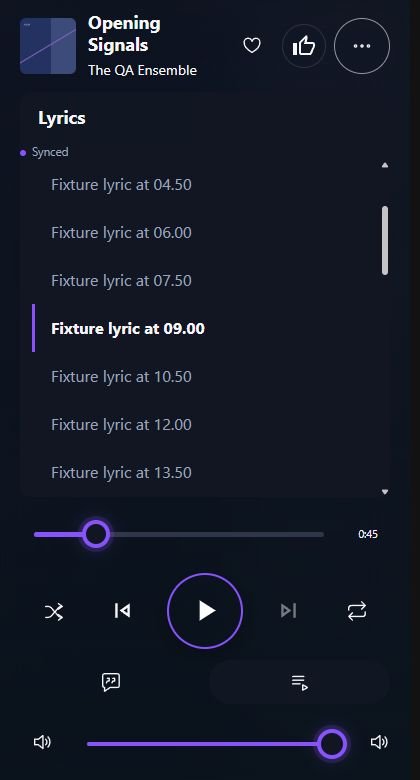
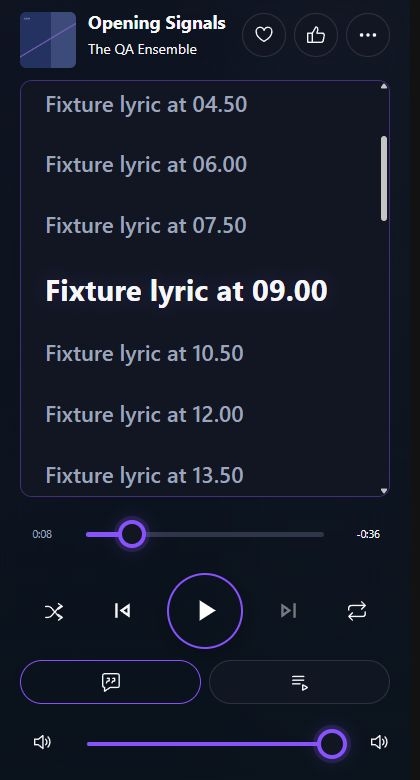
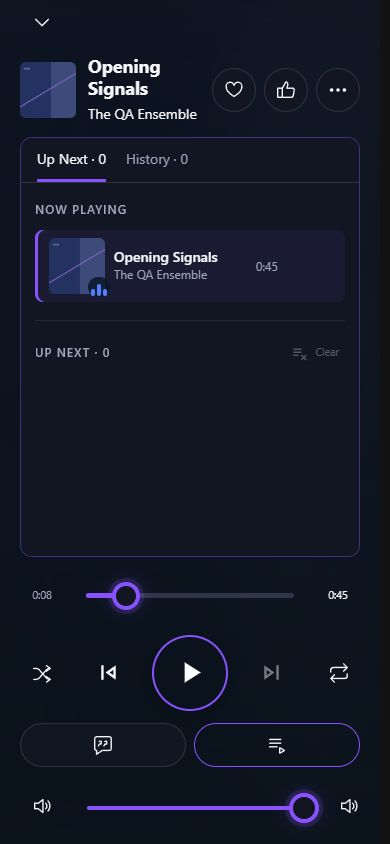

# Player visual consistency

October 5, 2026. Implements the product owner's visual corrections after the player delivery and CSS cleanup. The supplied screenshot guides hierarchy, circular actions and lyric emphasis; it is not a pixel-exact end-state specification.

## Product walkthrough

1. **The same song actions everywhere.** Favorite, Rate and More look and behave consistently in the dock, desktop expanded player, phone full player and popout. Each is an equally sized circle with a centered outline icon. Favorite remains distinct from Like/Dislike. Opening a menu or selecting an action keeps the row's geometry stable. Maps to implementation A; acceptance is equal targets, glyph sizes and borders on every surface, with working tooltips, keyboard focus and existing guarded callbacks.
2. **Lyrics take priority.** Opening the lyrics icon reveals larger, bolder text, a bright active line and quieter surrounding lines. There is no repeated Lyrics heading or Synced badge. Timed highlighting already communicates synchronization; meaningful empty/error messages and attribution remain. On a short phone, wrapped lyrics scroll within the card while seek, transport, view buttons and volume remain accessible. Maps to B; acceptance is the stronger hierarchy without clipped controls or changes to playback timing.
3. **A simpler upcoming/history view.** Opening the queue icon shows Up Next and History tabs, without a Continue Playing, Queue and history, or source header. Accessible panel names remain. The desktop expanded player keeps an icon-only lyrics tab beside Up Next and History. Maps to C; acceptance is one visible navigation row and no redundant card heading.

4. **Both time labels remain visible.** Every shared seek rail shows elapsed time on its left and total/remaining time on its right, including phone, popout and video. The right label still toggles between total and remaining time. Maps to D; acceptance is two visible labels during playback and seeking at narrow sizes.

## Implementation

- **A: one action-row owner.** `PlaybackSongActions` owns the geometry across all three host components. Targets are 44×44px with a 1px circular border; `PlaybackUtilityGlyph` supplies 22×22px icons, a shared 24-unit view box and 1.5-unit stroke. Rating uses this family in playback, while its other consumers retain their established presentation. More uses filled dots within the outline utility family. Retired Favorite and More size overrides were removed rather than covered with new priorities.
- **B: typography and panel styling.** Lyrics use the existing Segoe UI Variable/system interface family with container-based sizes: 20–28px adjacent lines and 26–38px active lines, weights 600 and 700. Active word fills use bright player text. The old left stripe and synchronization badge are removed. Missing panel/mode border-token references now use existing playback border tokens, restoring the outlined card and view controls. No timing or scrolling JavaScript was changed.
- **C: panel context.** Lyrics and queue/history omit the card header. Existing tabs, queue counts, current/upcoming sections and history behavior remain.

- **D: shared timeline labels.** The elapsed output is rendered by `PlaybackSeekRail` on every surface. Regression checks cover both labels, changing position and the existing end-time toggle.

The general same-row icon rule is recorded in AGENTS.md, CLAUDE.md and the design-system guidance. Peer controls must match icon family, view box, stroke, glyph size, target geometry, border and alignment. A deliberately dominant transport Play/Pause is a separate documented role. Icon-only controls require matching tooltips and accessible names.

## Verification

The disposable Player QA library supplied a synthetic 45-second track and timed lyrics. No configured library content was edited. Before/after captures cover dock, phone and popout; additional final captures cover desktop expanded, desktop lyrics, queue, and short-phone menus.

The read-only browser audit in `tools/validate-player-icon-rows.js` checks actual rendered sizes, centered glyphs, circular borders, glyph type/family and accessible labels. Wrap the function source as an invoked expression when using the browser evaluator. Measurements are saved in `tools/reports/player-visual-consistency-2026-10-05/icon-measurements.json`.

| Surface/state | Result |
| --- | --- |
| Dock at 1920×1080 | Three matching 44px circles and 22px glyphs |
| Desktop expanded at 1920×1080 | Expanded and dock rows both pass the same audit |
| Phone at 390×844 | Matching actions; headingless lyrics and queue/history tabs |
| Short phone at 320×568 | Matching actions; wrapped lyrics, both time labels and visible transport/volume; Rate and More open; volume ends at 556px inside the 568px viewport |
| Popout page at 420×780 | Matching actions; active lyric 29.44px/700, adjacent lyric 22.08px/600; 1px card border; elapsed 0:08 and remaining -0:36 |
| Favorited and rated dock states | Audit passes; existing reactions work; fixture reaction restored afterward |
| Restore and solution build | Passed; zero warnings/errors |
| Final full solution tests | 5,044 passed; 34 existing provider tests skipped; zero failures |
| Strict documentation build and whitespace check | Passed |
| Focused component/consistency checks | 35 passed |
| JavaScript checks | 118 passed |

The native separate-window action is not exposed as a controllable window by the in-app browser. The actual `/listen/player-popup` page was rendered in a separate verification tab and received fresh state from the main player. This verifies popout contents and geometry, not native window registration or command routing; existing command/lifecycle tests remain in place.

One existing API dispatcher timing test timed out during an earlier full run, passed in an isolated retry, and passed in the final full solution run. No unrelated API code was changed.

Before:

After:

## Plain English completion summary

Listeners get matching circular song controls wherever they play music, with elapsed and total/remaining time visible on both sides of the timeline. Lyrics are easier to read, and playback panels spend their space on the content rather than repeated headings. A shared implementation and a browser sizing check help future changes stay consistent.
