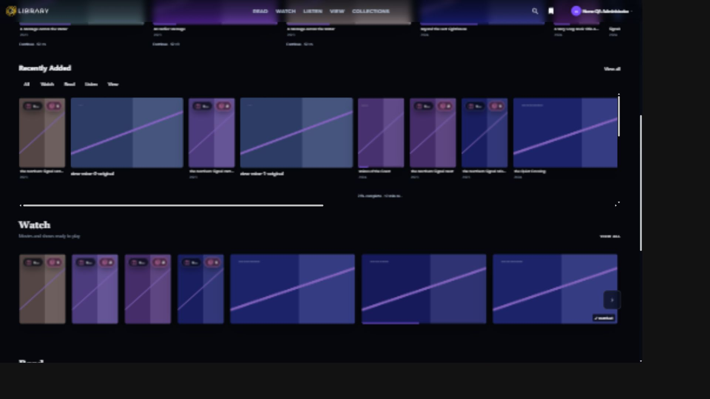
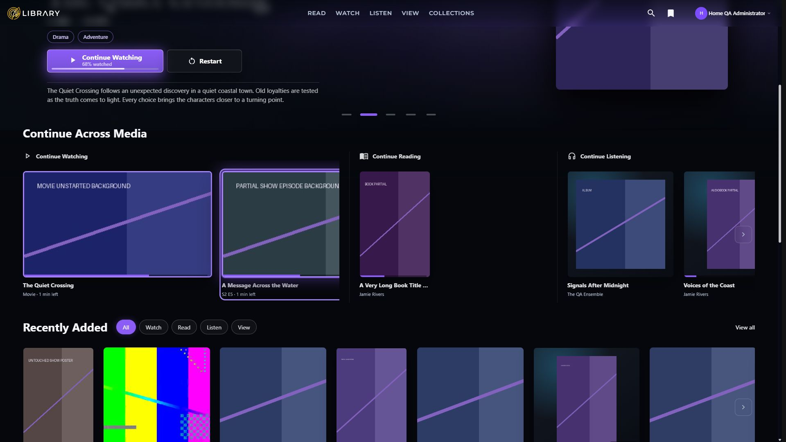
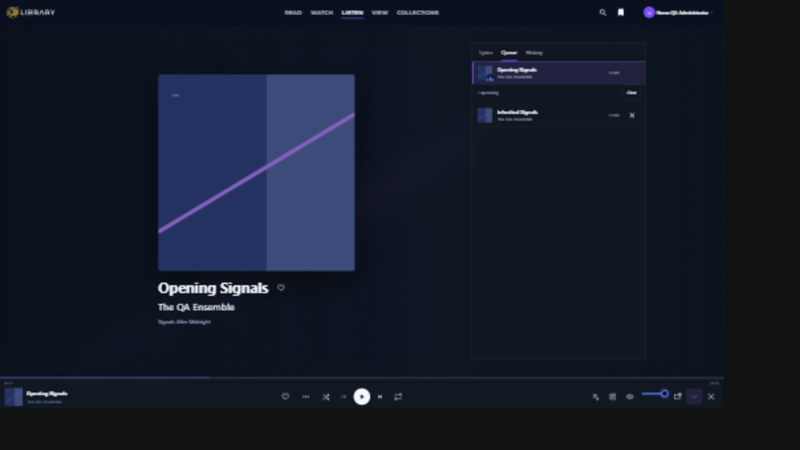
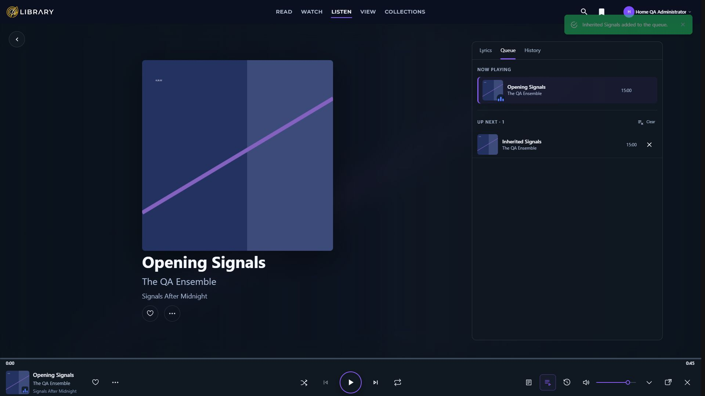
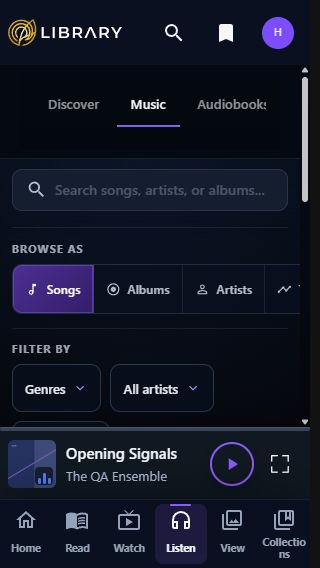
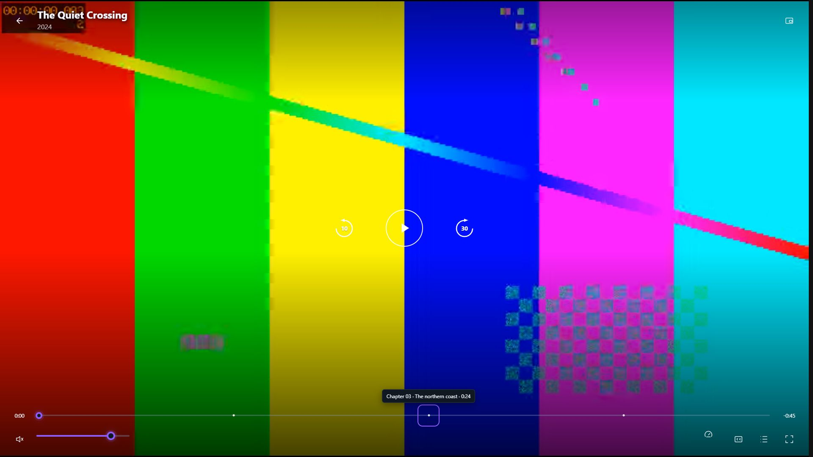
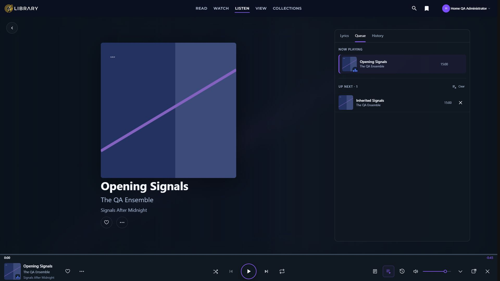

# Home Browse View and Player Remediation

The remediation is implemented locally in Tuvima Library. Home now groups Continue by media type, catalogue browsing uses consistent artwork frames, View has a working scroll frame, and audio and video players share consistent controls. The build and automated tests pass. Final acceptance remains open for the configured library, a real popup window, native device behavior, and physical pointer and touch checks.

The supplied handoff spec and three validation images defined the intended behavior. The images informed layout and control hierarchy; fixture artwork and the existing Tuvima header remain in the implementation. This report does not claim an exact pixel reproduction of the supplied mockups. Work was performed in one checkout with self-review. The requested independent reviewer was not run. Changes remain uncommitted and unpushed.

## Implementation and evidence

| Unit | Result | Evidence and limits |
|---|---|---|
| U0 baseline | Captured the original fixture UI before edits. | 49 screenshots have accepted geometry metadata. The baseline matrix is incomplete, especially popup, phone player, and View video states. No missing baseline was recreated after the changes. |
| U1 View | Added View to the lane frame and corrected the timeline's scroll-root selection and resize lifecycle. | Photos, Places, and Artwork captured. At short height the shell switches scroll ownership; a resize feedback loop was found and fixed. Keyboard scrolling moved the parent from 0 to 492 px with bounded content height of 1,723 px. Physical wheel, scrollbar drag, map story-panel scrolling, and the remaining View subpages still need device acceptance. |
| U2 Continue | Collapsed TV journeys by show and audiobook parts by book before composing cards. Most recent journey wins; profile identity remains part of the key. | API regression tests cover multiple episodes, audiobook parts, distinct identities, and newest selection. Per-file SQL remains unchanged. Repeated episode titles from different shows in the fixture represent different identities. |
| U3 tiles | Default Movie and TV tiles are portrait; Continue Watching is landscape. Audiobooks and albums use square frames. Removed detached progress captions and kept episode navigation and artwork-edge progress. Direct grids use glow only. | Movies grid and Home captures; shape and single-link render tests. Keyboard movie preview measured 385.994 px after the JavaScript expansion cap was corrected. Portrait Watch expansion is capped at 440 px. Physical pointer hover remains unverified. |
| U4 shelves | Extracted MediaShelfScroller; reused it for Recently Added. Removed native-ratio inline widths and duplicate composition. Boundary updates use resize and scroll events rather than every render. | Home All, Watch, Listen, and View filter captures; pressed states and wrapping Browse preserved. Filters have 48 px hit areas. D1 arrow refresh and D2 composition/refresh addressed. |
| U5 Home | Split Continue Across Media into Watching, Reading, and Listening; omit empty groups and stack on narrow screens. Suppressed Home media and track-count pills and removed duplicate loading markup. | Mixed and single-group render tests and viewport captures. No public Continue route exists, so no View all route was invented. D3 addressed. |
| U6 Home hero | Raised the desktop Home hero, kept short-screen and content-sized phone layouts, and selected framing from existing image dimensions. | Framing tests cover landscape, intermediate aspect, small, and unknown sources. Detail hero sizing remains 95svh. Standard and 200 percent CSS text stress captures. CSS stress is not browser zoom or a physical accessibility setting. |
| U7 dock | Unified music and audiobook slot geometry, purple outlined Play button, artwork entry point, and phone compact transport. | Play buttons in both desktop modes measured x=925, width=60, height=60. Their y values differed by 1 px. At 320 px the dock renders one 44 px Play control. Phone/coarse-pointer volume is suppressed; native OS-volume behavior is still pending. |
| U8 artwork and scene | Routed audio artwork through PlaybackArtworkUrl, including unsized stream covers and inherited album artwork. Rebuilt desktop Now Playing identity and panels. | Unsized Opening Signals cover resolves to canonical bounded artwork and loads at natural width 960. Artist and album are present in the existing payload. The scene shows 520 px music art, 340 px audiobook art, and actions below identity. |
| U9 panels | Unified context rows and anchored panels. Popup volume uses a small vertical slider rather than a sheet; queue preserves current item and operates on upcoming entries. | Queue captures and fixture removal changed 1 upcoming to 0 without removing the current item. Node tests cover caret placement and volume geometry; render tests cover popup composition. A real 420 by 780 popup and covering sheets were not visually verified because the in-app browser did not expose the launched window. |
| U10 video | Shared PlaybackVideoChrome between Watch and View. Removed the center transport's hold condition, retained header/bottom holds, and added keyboard chapter notches with number, title, and time. | Paused and playing-idle captures at seven sizes in both viewers. All chrome regions reached opacity 0 while native video continued. Keyboard tooltip appeared and Enter sought chapter 3 to exactly 24 seconds. The 3-second timer is covered by Node tests; browser observations were made later in the idle interval. |
| U11 lyrics | Used native audio time for the main view and client extrapolation for popup snapshots; applied positive and negative LRC offsets. Added configurable lead of 150 ms and tightened duration confidence bands. | Over 30.423 seconds, 326 samples recorded 20 active-line changes. Measured timing deltas ranged from 19.318 to 100.290 ms, within the 200 ms target. Reverse seek restored the earlier line. Parser, duration-band, clock, and lifecycle tests pass. Real popup clock behavior remains pending. D4 addressed. |
| U12 docs | Updated Dashboard rules, playback architecture, configuration, fixture instructions, and agent sync documents. Gated the QA text middleware at startup in Development with an explicit QA root. | Documentation build and front-matter check are recorded below. D5 addressed. |
| U13 verification | Build, solution tests, Node suites, syntax checks, fixture self-test, visual captures, and diff review. | Automated gates pass. Visual and device gaps below prevent claiming full acceptance. |

## Visual review

All captures use synthetic fixture data in a desktop browser with viewport emulation. No capture is from a physical phone or native app. Dimensions were checked against both the CSS viewport and exported JPEG; accepted captures also passed font/image readiness and unchanged geometry across capture. Geometry acceptance alone does not certify every visible detail.

After evidence contains 187 screenshots with accepted geometry. The index records rejected exports and the reasons they failed. Rejected images are excluded from the review package. Some accepted captures precede the final label or compact-control refinements; refreshed desktop and phone player, chapter, paused video, idle video, and Home hero captures are the final review examples. Fixture playback updated fixture progress, so percentages can differ between baseline and after images. That is not evidence of a real-library write.

### Home Continue before and after

Before:

After:

### Desktop music player

Before:

After:

### Phone dock and video chapters

The [capture index](remediation-2026-10-04/capture-index.json) lists every recorded state and its geometry acceptance. [Dock geometry](remediation-2026-10-04/after/fixture-dock-slot-geometry.json), [lyric timing](remediation-2026-10-04/after/fixture-lyrics-clock-30s.json), [movie preview geometry](remediation-2026-10-04/after/fixture-home-movie-hover-geometry.json), and [text stress measurements](remediation-2026-10-04/after/fixture-home-text-200-result.json) retain the measured values.

The viewport matrix is 1920 by 1080, 1536 by 864, 1280 by 720, 768 by 1024, 390 by 844, 320 by 568, and 844 by 390. Captured states include Home hero/Continue/Recent filters/Listen row; Watch Movies; Listen music; View Photos/Places/Artwork; music and audiobook dock/Now Playing; and Watch/View video paused and playing idle. Queue and chapter-tooltip captures are desktop examples. An actual 420 by 780 popup is still missing.

## Automated verification

Restore completed successfully. The final code build completed with zero warnings and zero errors. The full solution run passed 4,944 tests with 34 existing provider skips and zero failures. Development environment values used to launch the fixture were removed from the test process for the final full run; this resolved scope-validation failures in account endpoint test setup without changing authentication code or disabling validation.

| Test project | Passed | Skipped |
|---|---:|---:|
| MediaEngine.Admin.Tests | 5 | 0 |
| MediaEngine.AI.Tests | 55 | 0 |
| MediaEngine.Api.Tests | 1312 | 0 |
| MediaEngine.Contracts.Tests | 77 | 0 |
| MediaEngine.Domain.Tests | 330 | 0 |
| MediaEngine.Identity.Tests | 26 | 0 |
| MediaEngine.Ingestion.Tests | 218 | 0 |
| MediaEngine.Intelligence.Tests | 125 | 0 |
| MediaEngine.Performance.Tests | 3 | 0 |
| MediaEngine.Processors.Tests | 37 | 0 |
| MediaEngine.Providers.Tests | 582 | 34 |
| MediaEngine.Storage.Tests | 528 | 0 |
| MediaEngine.Web.Tests | 1646 | 0 |

All 76 Node tests passed in the final run, including the two new portrait-preview behavioral tests. All six changed JavaScript files passed syntax checks. Fixture self-test passed. Early checks caught a chapter-label encoding error and a fixture-launch environment leak; both were corrected and the final solution run is green. A build attempted while the app executable was locked failed; the subsequent app-scoped stop and clean build passed. No test threshold was weakened to make a gate pass.

The strict MkDocs build passed. All four edited documentation pages contain title, summary, audience, category, and product_area front matter. The final delivery build also passed with zero warnings and zero errors.

## Scope and fixture safety

No Contracts DTO, endpoint shape, schema, migration, authorization code, journey SQL, playback-owner state machine, bookmark owner, or popup registration protocol was changed. Diff review is a self-review, not an independent review. Shared CSS was consolidated without adding new important declarations; existing declarations were retained where present.

The disposable fixture is protected by its exact root and marker. It includes unsized and inherited music artwork, duplicate journey parts, owned lyrics with offsets, native audio/video, chapter markers, photos, a gallery, and GPS rows. Audio and video are compressed 45-second synthetic clips; catalogue duration claims intentionally differ from native duration. Fixture badges and progress have been exercised by test playback. Credentials, databases, and signed View grants are excluded from the evidence package.

The configured library was not seeded, reset, edited, or played. Its browse-only visual checks have not been completed because normal sign-in is required. Runtime restoration is recorded in the handoff below.

## Remaining acceptance checks

1. Sign in to the configured library and capture Home, Watch, Read, Listen, and View using browse, hover, and scroll only. Do not start playback there without explicit runtime approval.
2. Verify the actual popup at 420 by 780: full-player sheet coverage, vertical volume keyboard path, no in-player exit, unsized artwork, and lyric clock.
3. Verify physical wheel and scrollbar dragging, pointer hover, touch controls, reduced motion, and native OS-volume behavior. View gallery, folder, people, and map story-panel paths need final device coverage.
4. At 200 percent CSS text stress the Home hero flows vertically and has no horizontal document overflow. Phone navigation labels wrap at 320 px; physical accessibility text and zoom acceptance remain open.
5. Obtain independent review and complete the missing visual baseline comparisons before release. No push or publication was performed.

## Runtime handoff

Engine and Dashboard are running with the normal repository configuration at localhost ports 61495 and 5016. Fixture database, library, logs, backup, protection, and text-QA overrides were removed. The browser viewport override was reset and the configured-library sign-in page is open for the Product Owner. No fixture credentials were entered into the real library. Browse-only validation remains pending sign-in. The first restoration attempt left empty environment values and failed startup; complete removal corrected it without changing application configuration.

## Volume alignment follow up

Product review identified that the horizontal volume track sat above the speaker button. The dock and compact-menu volume tracks now use the vertical midpoint of their slider rail instead of a fixed track offset. At 1920 by 1080, speaker, track, and thumb centers all measured 1042.5 px; at 1536 by 864 all measured 826.5 px. Audiobook mode matched those values, and the compact menu button and track both measured 615 px. The [alignment measurements](remediation-2026-10-04/after/fixture-volume-alignment-geometry.json) preserve the results. The desktop music screenshot above has been refreshed.

The down arrow collapses expanded Now Playing to the dock. It now has a matching hover label. Fixture verification confirmed that the expanded view closed while the native audio element continued playing. This refinement built with zero warnings and errors, and all 1,646 Web tests passed. The earlier full solution result remains the baseline for the broader implementation.

## Now Playing product review follow up

The desktop context panel is approximately 13 percent narrower (520 px maximum, previously 600 px). The current track has a seven-percent purple tint with its left accent retained. NOW PLAYING and UP NEXT are distinct sections, with the upcoming count and Clear action sharing one row. Music retains exactly three tabs: Lyrics, Queue, and History. The artwork-to-metadata gap is reduced by 16 px, with a four-pixel stack gap.

Artist and album names navigate while closing the expanded scene so their destinations are visible. A canonical artist person link is used when available; name-only metadata uses the existing Music-filtered search. The track title remains plain. Fixture interaction confirmed ongoing native audio during artist navigation and the canonical album details destination. No visible controls were added.

The dock now shows elapsed time and a clickable end-time value that toggles total duration and remaining time, softer selected-tool outlines, and a two-pixel volume track with a twelve-pixel thumb. Music and audiobook speaker, track, and thumb centers coincide at 1042.5 px in the 1920 by 1080 viewport. Shared tooltips cover mute, queue, expand/collapse, pop-out, and close; keyboard focus revealed the separate-window tooltip. The down arrow collapses Now Playing while playback continues. Phone testing exposed an overlapping scrubber touch area; centering that existing 52 px hit area on the timeline restored the expand button without reducing target size.

Following the additional product direction, the shared play/pause glyph is white and the surrounding ring is purple across dock, full music/audiobook, and video appearances. Browser measurements confirmed white RGB 255/255/255 and purple RGB 139/92/246 in both audio and video controls. The music scene was captured at all seven viewport sizes; phone collapse and re-expansion were exercised at 320 px. These are browser-emulated checks, not physical-device acceptance.

The final follow-up build passed with zero warnings and errors, and all 1,648 Web tests passed after rebuilding the test project. Two new cases verify artist identity and name-only navigation, canonical album links, plain title, and the three-tab contract. One intermediate run failed a settings route assertion while another test temporarily changed shared static production-mode state; no settings code was changed, and subsequent complete Web runs passed. The earlier full-solution and Node results remain the broader baseline. Rejected screenshots with capture-scale mismatches were excluded; a fresh browser surface produced the exact-size final captures.

## Integrated queue action and time display follow up

Clear now sits directly in the UP NEXT header as a borderless list-removal icon plus label, with a shared tooltip, visible keyboard focus, and a 44 px minimum target. Clearing retains the current track, removes upcoming occurrences through the existing command, and disables the action when no upcoming tracks remain.

The visible Elapsed and Remaining words have been removed. The left value shows elapsed time; the right value defaults to total duration and toggles to minus-prefixed remaining time on click, Enter, or Space. Accessible names and tooltips explain the toggle. This is local presentation state and sends no playback command. The desktop dock is 104 px tall with additional top padding; the measured time-to-artwork gap is 13.5 px. The phone dock retains its 72 px layout and hides desktop time values.

Fixture browser checks confirmed both click and Enter toggling without changing the native audio position, Clear behavior and its empty state, and exact-size captures at all seven viewport sizes. The final build passed with zero warnings and errors, and all 1,648 Web tests passed. The existing layout assertion was updated from the previous 92 px dock height to the requested 104 px spacing. No authorization, queue-owner, or playback protocol code changed.

## Product owner summary

Home is easier to scan, Continue no longer repeats files from the same show or audiobook, and the players now use consistent controls and artwork. Now Playing feels lighter, separates the current track from upcoming tracks, and uses a white play icon inside a purple circle. Artist and album links make exploring the library easier while listening. Clear is integrated into the queue header, and the quieter time display switches between total and remaining with a click. Automated checks and synthetic-library visuals pass. The work still needs a browse-only check of your actual library and testing in a real popup and on physical devices before it is ready for release.
